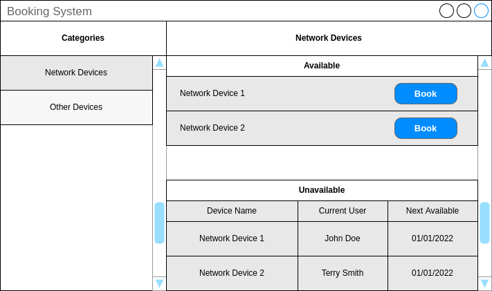

# booking_system
Booking system for Titania technical challenge

# Dependencies

- Qt >= 5.15.4
- CMake >= 3.0.0
- Make

# Frontend Mockup

# Notes

This repository contains both the frontend and the backend to the booking system. Generally it would be more beneficial to split the frontend and backend into two repositories since they are standalone pieces of the system (and it makes vscode happy). Despite this, it is included in a single repo for ease of demonstration, testing, and such that all code can me seen in one place by whoever may analyse it.
